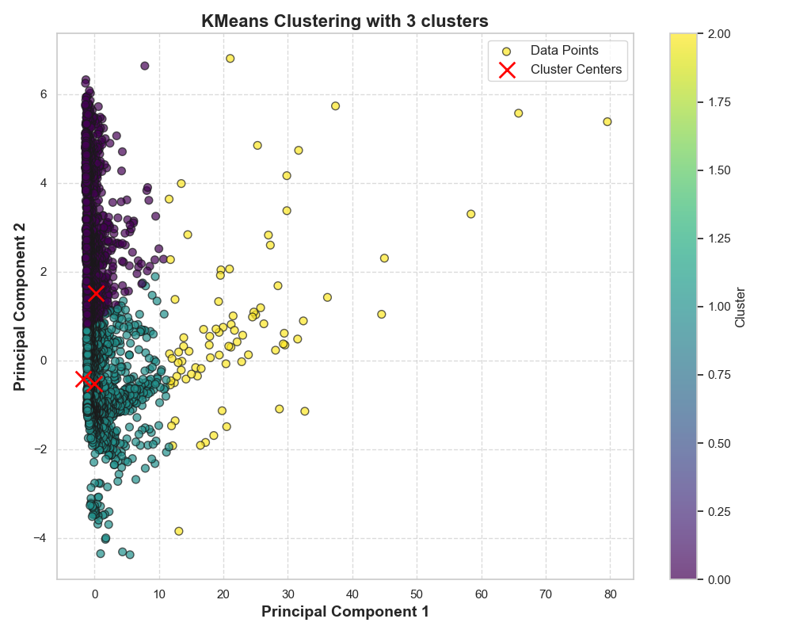
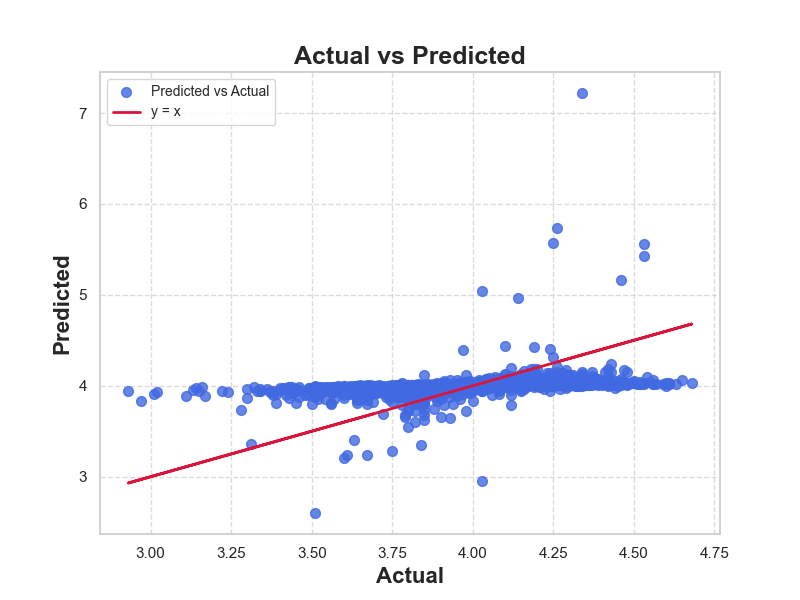
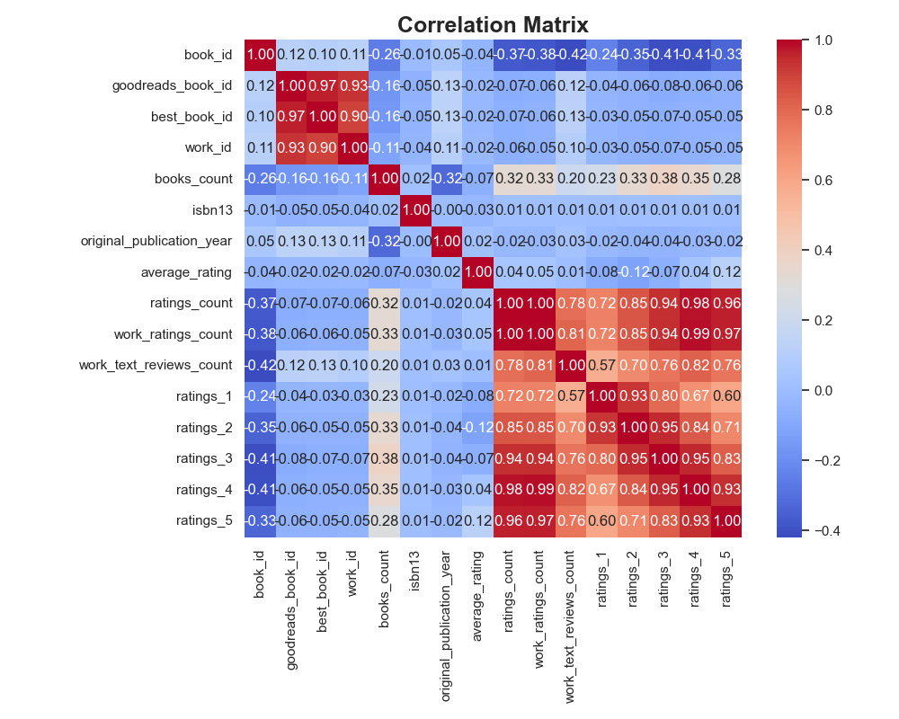
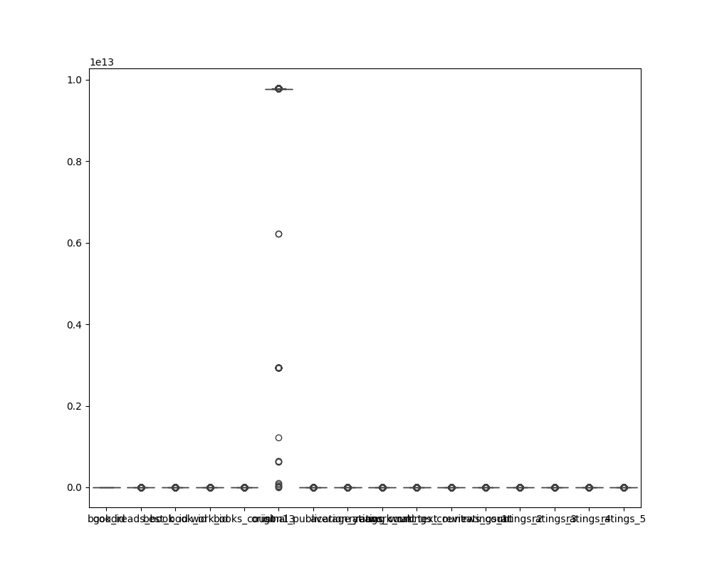

# Unraveling the World of Books: Insights from Goodreads Data

In the vast universe of literature, every book holds a story within its pages, waiting to be discovered. But what about the stories behind the books themselves? By diving deep into the data from Goodreads, we can unearth fascinating insights about popular titles, their authors, and reader engagement. Join me on this explorative journey as we unveil the hidden narratives within the numbers.

## A Snapshot of Popular Titles

Our journey begins with a glimpse into the first three beacons of literary fame in our dataset:

1. **The Hunger Games** by *Suzanne Collins* (2008)
   - Average Rating: 4.34
   - Ratings Count: 4,780,653
   - 

2. **Harry Potter and the Sorcerer's Stone** by *J.K. Rowling* (1997)
   - Average Rating: 4.44
   - Ratings Count: 4,602,479

3. **Twilight** by *Stephenie Meyer* (2005)
   - Average Rating: 3.57
   - Ratings Count: 3,866,839

These titles are not just bestsellers; they are cultural phenomena that have captured the hearts of millions. However, the variations in their ratings reveal an intriguing aspect of reader sentiment—while *Harry Potter* reigns supreme, *Twilight* has a significant divide in its reception.

## Statistical Overview: The Bigger Picture

As we broaden our perspective, we can see the overall landscape of the dataset, which comprises 10,000 books. Here are some key statistics that paint a vivid picture of the literary world:

- **Average Rating:** 4.00
- **Total Ratings Count:** 540,012
- **Books Published Since 1981:** The dataset's mean publication year is 1981, showing a rich history of literary contributions.

### Missing Links

In our quest for knowledge, we must also acknowledge the missing pieces. Notably, we have:
- 700 missing ISBN entries
- 585 missing original titles
- 1084 missing language codes

Addressing these gaps will enhance the dataset's richness and potential for analysis.

## Regression Analysis: Predicting Reader Sentiment

To understand what influences a book's average rating, we conducted a regression analysis. The findings reveal several factors that impact reader sentiment:

### Key Features Influencing Ratings
- **Books Count:** A higher number of books does not necessarily correlate with better ratings.
- **Original Publication Year:** More recent publications tend to score higher, reflecting contemporary reader preferences.
- **Ratings Count:** A significant determinant, the higher the ratings count, the better the average rating.

Despite the r² score of 0.05 indicating a weak correlation, the insights are invaluable for authors and publishers aiming to craft successful titles.

## Clustering: Grouping Literary Gems

Next, we ventured into clustering analysis, seeking to group books based on their characteristics. Three distinct clusters emerged, each representing different styles and reader engagement levels. 

### Cluster Highlights:
- **Cluster 0:** Features books with high ratings but lower engagement.
- **Cluster 1:** Comprises high-engagement books that may not always have high average ratings.
- **Cluster 2:** Encompasses titles with both high ratings and high engagement, like *Harry Potter* and *The Hunger Games*.

Visualizing these clusters sheds light on reader preferences and can guide marketing strategies for authors.

## Outliers: The Unconventional Choices

No analysis would be complete without acknowledging the outliers—books that defy trends and expectations. These gems often surprise us, showing that reader taste can be unpredictable. 

## Recommendations: Crafting the Next Bestseller

Based on our findings, here are actionable recommendations for aspiring authors and publishers:

1. **Engage with Readers Early:** Build an audience before the publication to ensure higher initial ratings.
2. **Focus on Quality Over Quantity:** A smaller catalog of well-crafted books can lead to better overall ratings.
3. **Leverage Social Media:** Engage with readers across platforms to gather feedback and create buzz around upcoming titles.

## Conclusion: The Narrative Continues

As we wrap up our analysis, it’s clear that the world of books is as complex and layered as the stories they tell. By harnessing data from platforms like Goodreads, we can better understand reader preferences, craft compelling narratives, and ultimately enrich the literary landscape.

The journey doesn't end here; it evolves with each new title, reader interaction, and changing trend. Let the numbers guide us as we continue to explore the enchanting realm of literature.

