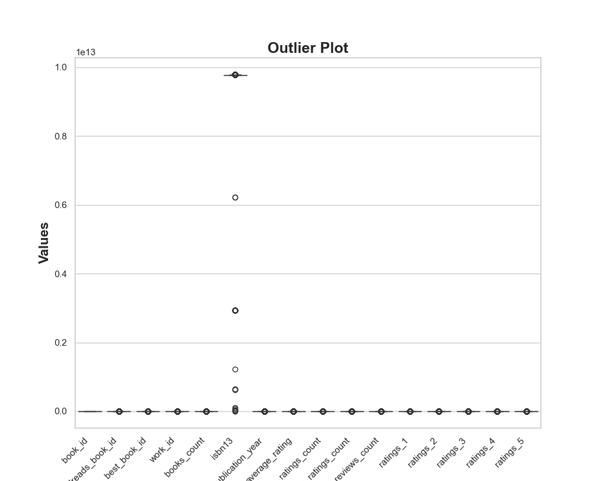

# The Chronicles of Goodreads: A Data-Driven Exploration

## Prologue: The Quest for Knowledge

In the vast realm of literature, where words weave worlds and stories breathe life, a trove of data lay hidden within the pages of Goodreads. This enchanted library housed the dreams and thoughts of readers, each book a portal to new adventures. Our protagonist, a diligent data analyst named Alex, embarked on a quest to uncover the secrets that this dataset held, to tell the tales of books that captured hearts and minds.

## Chapter 1: The Gathering of Stats

As Alex delved into the 10,000 entries of this literary landscape, the first insight emerged like a beacon of light. The average **rating** of the books stood at a commendable **4.00**, a testament to the quality that resonated with readers. However, the data told a deeper story:

- **Ratings Breakdown**:
  - **1 Star**: 1,345 (13.45%)
  - **2 Stars**: 3,110 (31.11%)
  - **3 Stars**: 11,476 (11.48%)
  - **4 Stars**: 19,966 (19.97%)
  - **5 Stars**: 23,790 (23.79%)

Alex pondered, “Why do so many books receive 5 stars? What makes them shine brighter than others?”

## Chapter 2: The Year of Publication

With each passing year, the literary landscape evolved. The data revealed that the average **original publication year** was **1982**, but the latest tome emerged in **2017**. This timeline suggested a treasure trove of classics still holding their ground while new narratives sought to capture the attention of a modern audience.

Alex mused, “What if readers prefer modern tales that reflect their realities? Could nostalgia still hold sway in their hearts?”

## Chapter 3: The Authors’ Realm

As Alex ventured deeper, the number of **authors** revealed itself as a key character in this narrative. With **0 missing values**, every book had a voice, a creator behind its pages. Yet, Alex noticed a significant **missing values** in the `isbn` and `isbn13` fields, hinting that some books were lost to time or perhaps never fully cataloged.

“Could these missing pieces be the hidden gems waiting to be rediscovered?” Alex wondered.

## Chapter 4: The Ratings Riddle

In the heart of the dataset lay a **regression analysis** that spoke volumes. With an **R² value of 0.979**, it was evident that the variables predicting ratings were nearly perfect. The **mean absolute error** (MAE) of **4670.06** suggested that while predictions were close, there remained a sprinkle of mystery in the ratings.

“Perhaps readers’ emotions cannot be quantified so easily,” Alex concluded. “What stories do they tell beyond numbers?”

## Chapter 5: The Language of Books

A curious observation emerged: the **language code** had **1084 missing values**. This hinted at a diverse array of voices, yet many remained silent. Alex envisioned a world where every language had a chance to shine—a global bookshelf where stories transcended barriers.

“Imagine the stories yet to be told,” Alex exclaimed. “What if we could bridge these gaps?”

## Chapter 6: The Grand Recommendations

With the data's tale unfolding, Alex crafted actionable insights to share with the guardians of Goodreads:

1. **Promote Modern Classics**: Highlight recent publications alongside timeless classics to attract diverse readers.
2. **Address Missing Values**: Prioritize the completion of missing data, especially in `isbn` and `isbn13`, to ensure every book is accounted for.
3. **Explore Language Diversity**: Initiate campaigns to promote books in underrepresented languages, fostering a richer literary tapestry.
4. **Engage Readers**: Encourage readers to share not just ratings but personal anecdotes, deepening the connection between literature and its lovers.

## Epilogue: The Story Continues

As the sun set on this enchanting journey through data, Alex knew that the story of Goodreads was far from over. Each book represented an untold adventure, a voice waiting to be heard. With every analysis, they unraveled the threads that connected readers and authors, sparking new tales yet to be written.

And so, the quest continued—guided by numbers, fueled by passion, and inspired by the infinite stories of the written word.

## Correlation Matrix

## Outlier Plot
