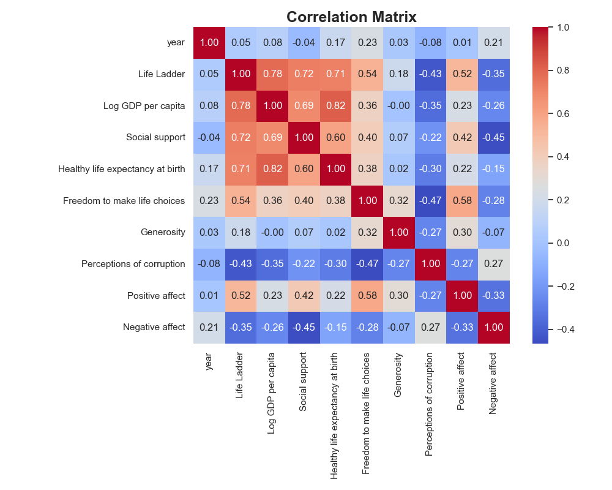
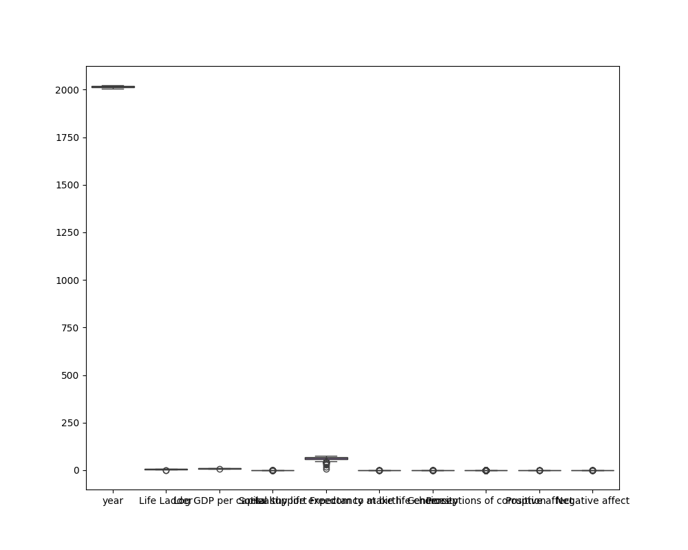

# The Story of Happiness: A Data-Driven Journey

## Introduction: The Quest for Happiness

In a world bustling with information and statistics, the pursuit of happiness remains a universal aspiration. Our journey begins with a dataset that captures the essence of happiness across various countries, examining factors that contribute to our overall well-being. Join us as we navigate through the lands of data, uncovering insights and stories that reveal the secrets behind the Life Ladder—a metaphorical climb towards happiness.

## The Characters: Countries and Their Stories

Meet our diverse cast of characters—countries from every corner of the globe, each with its own unique narrative:

- **Finland**: The perennial champion of happiness, known for its high social support and freedom to make life choices.
- **Burundi**: At the bottom of the Life Ladder, grappling with issues of corruption and social instability.
- **United States**: A land of opportunity, yet facing challenges of inequality and mental health crises.

### Chapter 1: The Data Speaks

As we delve into the data, we find several key metrics shaping the happiness landscape:

- **Life Ladder**: The average happiness score stands at **5.484** out of 10, with a maximum of **8.019** and a minimum of **1.281**.
- **Log GDP per Capita**: A strong correlation exists between wealth and happiness, with an average log GDP of **9.4**.
- **Social Support**: The mean score of **0.809** suggests that countries with better social safety nets tend to fare better in happiness rankings.
- **Healthy Life Expectancy**: Averaging **63.4 years**, this metric highlights the importance of health in our quest for happiness.

### Chapter 2: The Plot Thickens

As we analyze the data, we uncover interesting trends:

- **Corruption's Dark Shadow**: Countries with high perceptions of corruption (mean score of **0.744**) tend to struggle with happiness. Take our character **Burundi**—the burden of corruption weighs heavily, leading to a low Life Ladder score.
  
- **Freedom to Choose**: The freedom to make life choices is a significant predictor of happiness, with an average score of **0.75**. Imagine **Finland**, where citizens enjoy robust freedoms and social support, leading to their top position in happiness rankings.

- **Generosity Gap**: Interestingly, the average score for generosity sits at **0.0**, indicating that many countries struggle to foster a culture of giving. This presents an opportunity for growth—encouraging social responsibility could lead to increased happiness.

### Chapter 3: The Data's Dialogue

Through the voices of our characters, we hear their thoughts and feelings:

**Finland**: "We prioritize social support and freedom. It’s not just about wealth; it’s about connection and trust."

**Burundi**: "Our struggles with corruption and instability make it hard to dream. We need change from the ground up."

**United States**: "We have opportunities, but stress and inequality shadow our successes. We must focus on mental health and community."

### Chapter 4: Insights and Recommendations

As our story unfolds, we draw actionable insights:

1. **Strengthen Social Support**: Countries should invest in social programs that support mental health, community building, and access to healthcare. This could raise the Life Ladder scores significantly.

2. **Combat Corruption**: Transparency and good governance are essential in improving happiness levels. Initiatives to reduce corruption can create more equitable societies, as seen in the success stories of top-ranking nations.

3. **Promote Generosity**: Fostering a culture of giving and community engagement can enhance social bonds, leading to improved overall happiness. Campaigns that encourage volunteerism and charitable actions should be promoted.

### Chapter 5: The Journey Continues

As we conclude our exploration, it is clear that happiness is a multifaceted journey involving various factors—economic stability, social support, health, and a culture of generosity. The data paints a vivid picture, guiding countries on the path to creating happier societies. 

Join us next time as we dig deeper into the numbers, revealing more stories hidden within the data. Together, we can climb the Life Ladder to a brighter future! 

---

*In the world of data, every statistic tells a story; let’s continue to listen and learn.*

## Correlation Matrix

## Outlier Plot
