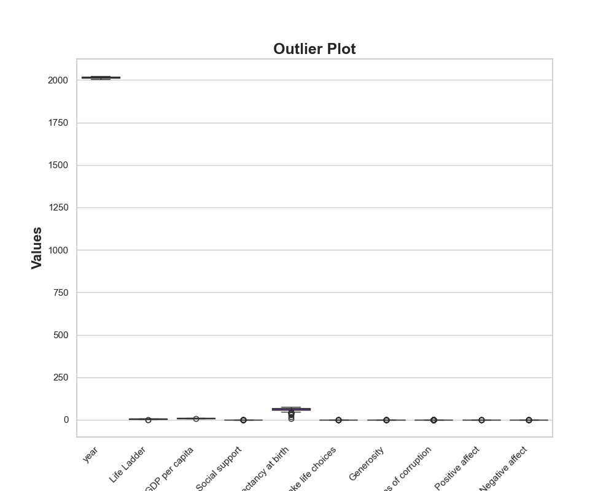

# Exploring the Pursuit of Happiness: Insights from Global Data

In a world that often feels chaotic and unpredictable, the quest for happiness remains a universal pursuit. What makes us happy? Is it wealth, health, social connections, or perhaps the freedom to make life choices? With this question in mind, we delve deep into the dataset captured in the **happiness.csv**, revealing stories and insights that can guide policymakers, organizations, and individuals alike in fostering a happier world.

## The Landscape of Happiness: A Global Overview

Our exploration begins with a broad overview of happiness across nations and over time. The dataset comprises records from **2,363 countries** spanning various years, providing a rich tapestry of human experience. Key indicators such as the **Life Ladder**, **Log GDP per capita**, and **Social Support** emerge as critical components that influence happiness levels globally.

### Key Insights:

- **Life Ladder Scores**: The average score across the dataset sits at **5.484** with a notable standard deviation of **1.126**, indicating significant variance in happiness levels globally. The highest score recorded is **8.019**, while the lowest dips to **1.281**. This disparity highlights the vast differences in well-being experienced by individuals in different regions.
  
- **Economic Influence**: A strong correlation exists between **Log GDP per capita** and happiness, with the average GDP logged at **9.4**. This suggests that economic prosperity plays a substantial role in enhancing life satisfaction.
  
- **Social Connection**: An average social support score of **0.809** indicates that individuals who feel supported by their communities tend to report higher levels of happiness. This underscores the importance of social networks in our well-being.

## The Power of Choice and Freedom

One of the most striking findings pertains to **freedom to make life choices**, which holds a direct correlation with happiness. With an average score of **0.75**, individuals who feel they have control over their decisions report significantly higher happiness levels. This suggests a vital area for governments and organizations to focus on—empowering individuals through policies that enhance autonomy and choice.

### Recommendations:

1. **Policy Reform**: Governments should consider enacting policies that enhance personal freedoms, fostering environments where individuals can make choices that align with their values and aspirations.
  
2. **Community Programs**: Initiatives that encourage social support—such as community centers, mentorship programs, and social networks—can enhance feelings of connectedness and belonging.

## Understanding Emotional Landscapes

As we delve deeper, emotional factors like **Positive Affect** (average score of **0.652**) and **Negative Affect** (average score of **0.273**) come to the forefront. The emotional balance between positive and negative experiences plays a crucial role in life satisfaction. Regions with higher positive affect scores typically exhibit better overall happiness.

### Visualizing Emotional Trends

The time series analysis reveals trends in happiness over the years. Notably, there is a gradual upward trend in happiness, suggesting that, globally, people are experiencing improved well-being. However, fluctuations in certain years highlight the impact of global events on emotional well-being.

## The Data-Driven Path Forward

In our regression analysis, we reveal that key factors such as **Log GDP per capita**, **Social Support**, and **Healthy Life Expectancy** are strong predictors of happiness, with an impressive **R² score of 0.758**. This means that a significant portion of the variance in happiness can be explained by these factors.

### Actionable Recommendations:

1. **Invest in Health**: Improving healthcare access and promoting healthy lifestyles can enhance life expectancy and, in turn, happiness levels.
  
2. **Economic Development**: Policies aimed at boosting economic development—especially in low GDP countries—can create environments where people feel more secure and happier.

3. **Focus on Emotional Well-being**: Mental health initiatives aimed at reducing negative affect and enhancing positive emotional experiences should be prioritized. Programs in workplaces, schools, and communities can cultivate resilience and emotional intelligence.

### Tackling Corruption Perceptions

Interestingly, perceptions of corruption also influence happiness, with an average score of **0.744**. Countries perceived as less corrupt tend to report higher happiness levels. This indicates a strong link between trust in institutions and overall life satisfaction.

### Final Thoughts

As we wrap up our exploration of happiness through data, it is clear that while wealth, health, and social support are pivotal, the freedom to make choices and the perception of a corruption-free society are equally important. By focusing on these aspects, we can pave the way for a happier global community.

The journey to happiness is complex and multifaceted, but with data-driven insights, we can make informed decisions to foster a more joyful world for everyone. Together, let us continue to explore, understand, and ultimately enhance the human experience.

