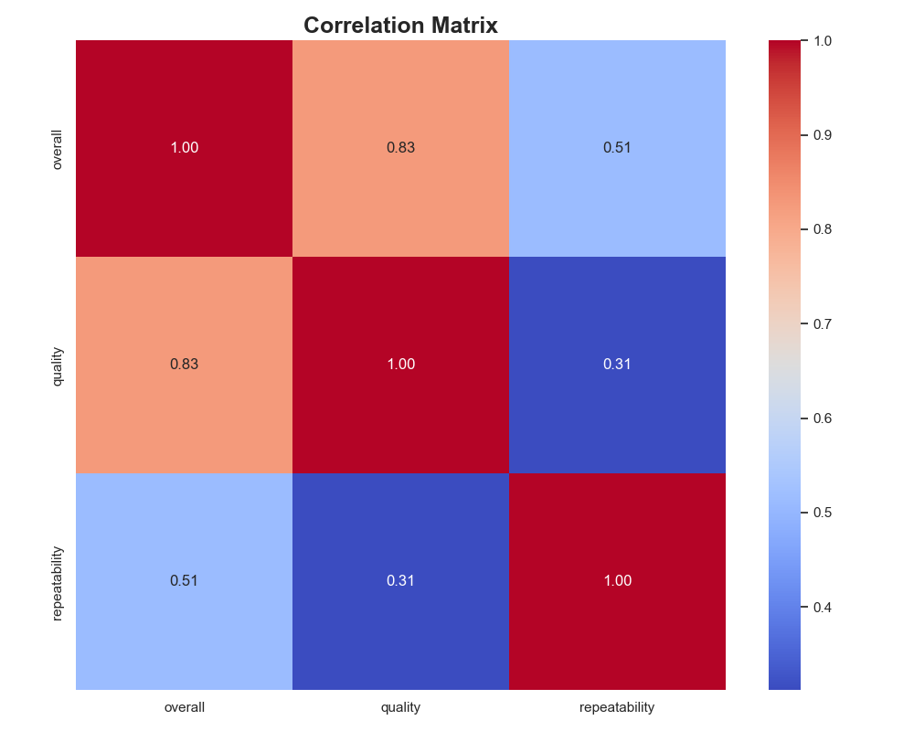
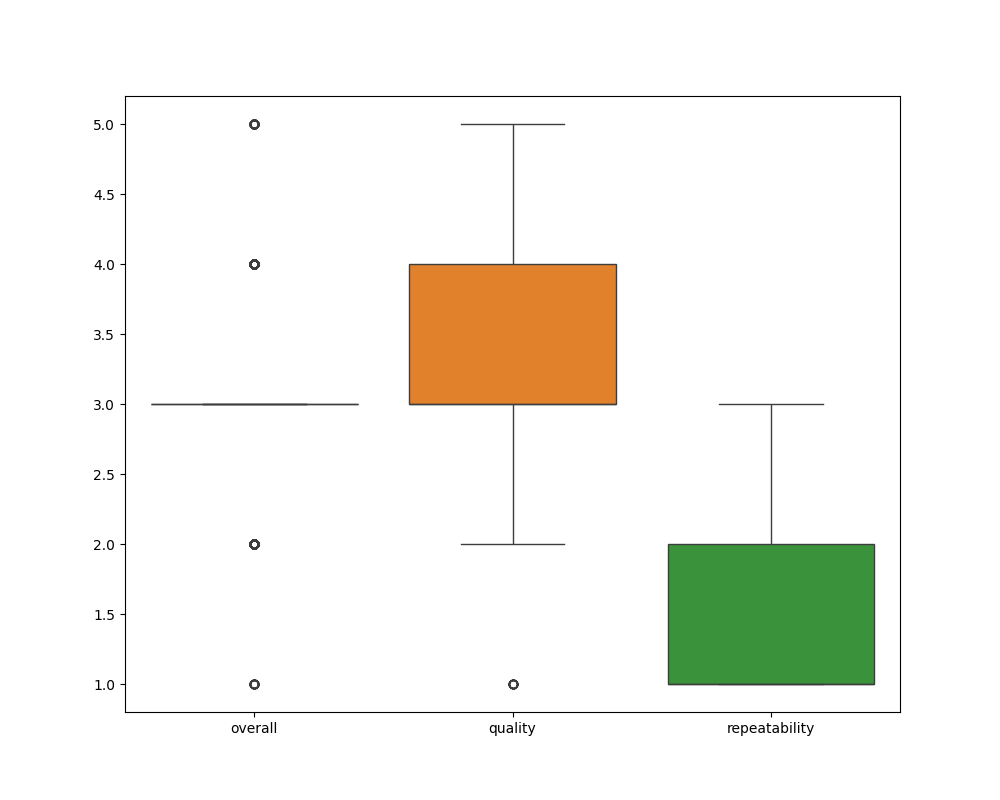

# Data Storytelling: Unveiling Patterns in Quality Ratings

## Introduction

In a bustling town known as **Data City**, where information flowed like rivers, three curious analysts—**Annie**, **Ben**, and **Clara**—set out to make sense of a mysterious dataset they stumbled upon in the town’s digital library. This dataset, a treasure trove of ratings, held secrets about consumer perceptions of quality and repeatability.

As they gathered around a large oak table littered with papers and laptops, the trio realized they needed to dive deep into the data, searching for insights that could help local businesses thrive in a competitive environment.

---

## The Characters

- **Annie**: The optimistic data analyst who believed in the power of numbers to tell a story.
- **Ben**: The pragmatic statistician, always ready with formulas and regression models.
- **Clara**: The creative storyteller, who saw beyond numbers and aimed to weave engaging narratives.

---

## The Quest Begins

With the dataset laid out before them, Annie excitedly opened the **General Analysis** section. 

"Look at this!" she exclaimed, pointing at the summary statistics. "We have a total of 2651 ratings. The overall average rating is 3.048, but quality averages a better 3.209. There's something to be uncovered here!"

Ben, with his brow furrowed, added, “Yes, but we also have to consider the **standard deviation**. It tells us how spread out the ratings are. A standard deviation of 0.762 for overall ratings suggests some ratings are quite far from the mean.”

Clara chimed in, “What about the extreme values? The minimum rating is 1, and the maximum is 5. This indicates a polarized perception among users. Let's visualize this!”

---

## Unearthing Insights

As the trio visually represented the dataset, bar graphs and scatter plots sprung to life on their screens. Clara narrated the findings like an engaging storyteller, painting a vivid picture of the data:

1. **Quality Matters Most**: The average rating of 3.209 for quality shows that customers value quality over repeatability, which only averages 1.495. This suggests a clear opportunity for businesses to enhance their product quality.

2. **Polarized Opinions**: With a mean of 3.048 for overall ratings but a minimum of 1 and maximum of 5, Clara proposed, “This indicates that we have both satisfied and disgruntled customers. Perhaps we can segment our audience based on their ratings.”

3. **Missing Values as Clues**: Annie pointed out, “Look here—there are 98 missing date entries and 261 missing 'by' entries. This could indicate inconsistencies in data collection, or perhaps certain reviews were given but lacked proper context.”

---

## Plotting a Path Forward

After a spirited discussion, the team brainstormed actionable recommendations:

- **Focus on Quality Improvements**: Businesses should prioritize quality improvements and actively solicit feedback to understand specific areas for enhancement.

- **Targeted Marketing for Different Segments**: By analyzing the ratings further, they could design tailored marketing campaigns that address the concerns of dissatisfied customers while celebrating positive experiences from satisfied ones.

- **Cleansing and Enriching Data**: To tackle the missing values, businesses could implement better data collection processes or incentivize customers to fill out missing information, providing a more robust dataset for analysis.

---

## The Conclusion

As the sun set over Data City, casting a warm amber glow through the windows, Annie, Ben, and Clara leaned back, satisfied with their findings. They had not only uncovered valuable insights but had painted a narrative that would help local businesses elevate their services.

Ben concluded, “Data is not just numbers; it's stories waiting to be told. By understanding our customers' perceptions, we can help them thrive.”

Clara added, “And it’s our job to narrate those stories, ensuring they resonate and create real change in the community.”

United by their shared passion for data and storytelling, the trio left the conference room with a sense of purpose, eager to present their findings in the next town meeting. 

---

## Final Thoughts

In a world filled with numbers and statistics, the ability to find meaning and craft a narrative is what drives true understanding. By embracing data analysis as storytelling, we unlock the potential for profound insights, ultimately guiding strategies that resonate with audiences and foster growth.

## Correlation Matrix

## Outlier Plot

