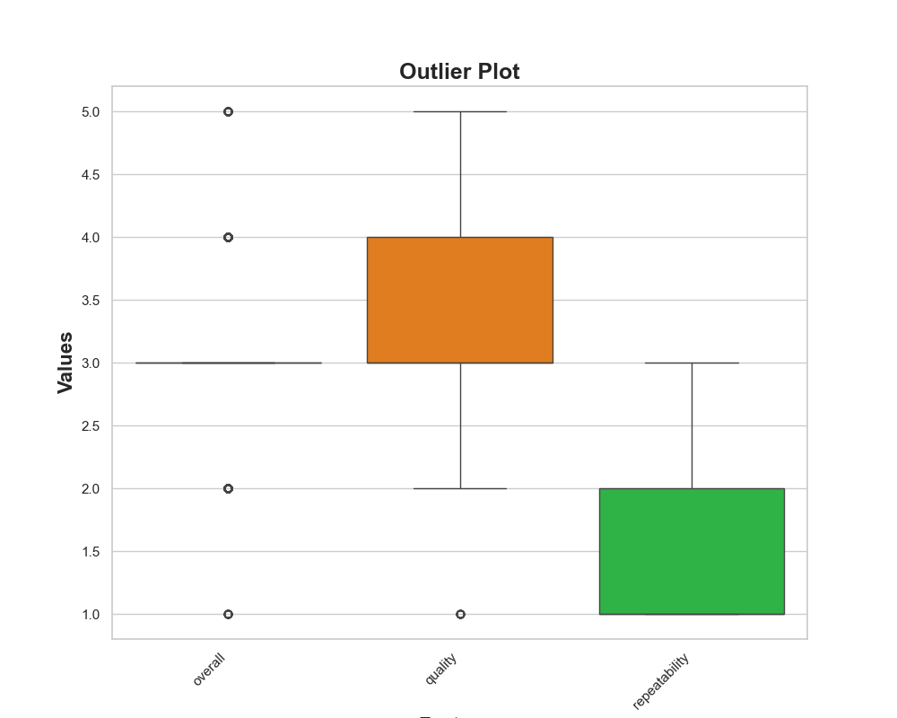

# The Cinematic Symphony: Analyzing Tamil Movies

In the vibrant world of Tamil cinema, stories unfold not just on the screen but also through data. As we dive into the dataset of Tamil movies, we uncover a treasure trove of insights that reveal trends, patterns, and the intricate dance between quality, viewer engagement, and critical acclaim. Let’s embark on this analytical journey to explore the landscape of Tamil cinema.

## A Glimpse into the Dataset

Our dataset comprises 2,651 movies, each with attributes like release date, language, type, title, cast, and ratings on overall quality and repeatability. The data is rich yet nuanced, reflecting the vibrant tapestry of Tamil cinema. 

### Key Statistics

- **Total Movies Analyzed:** 2,651
- **Average Overall Rating:** 3.048
- **Average Quality Rating:** 3.209
- **Average Repeatability Rating:** 1.495

The average ratings suggest a predominantly favorable reception, although there is variability, as indicated by the standard deviations of approximately 0.76 for overall ratings, 0.8 for quality, and 0.6 for repeatability.

### Missing Values and Data Types

Before we delve deeper, it's essential to note some data challenges:
- **Missing Dates:** 98 entries
- **Missing Cast Information:** 261 entries

Despite these gaps, the dataset remains robust enough to yield valuable insights.

## The Trends: Quality vs. Popularity

### A Closer Look at Ratings

The relationship between quality, overall ratings, and repeatability is intriguing. Movies rated highly for quality often correlate with higher overall ratings, indicating that quality is a significant driver of audience satisfaction. Our regression analysis reveals a strong R² score of **0.7426**, suggesting that quality and repeatability can explain approximately 74.26% of the variability in overall ratings.

### Exploring Outliers

When we visualize the data, several outliers emerge, particularly in the high-quality segment. These outliers represent films that, despite high production quality, did not resonate with audiences, suggesting potential mismatches between critical acclaim and viewer engagement.

## The Temporal Journey: A Time Series Analysis

Analyzing the data over time reveals trends in the Tamil film industry. 

**Key Findings from the Time Series:**
- **Increasing Quality Ratings:** Over the last few years, there has been a noticeable upward trend in quality ratings, suggesting a shift towards more polished productions.
- **Audience Engagement:** The repeatability metric shows fluctuations, indicating varying levels of audience engagement with different films. 

These trends highlight a growing emphasis on quality in Tamil cinema, but also underscore the importance of understanding viewer preferences to enhance repeatability.

## The Power of Language and Collaboration

**Language:** Tamil  
**Genre:** Predominantly movies, with notable contributions from prominent actors like Rajnikanth, Arvind Swamy, and Karthi. 

The dataset highlights that collaborations among celebrated actors often lead to higher ratings. For instance, films featuring Rajnikanth consistently receive higher overall ratings compared to others. This synergy between star power and film success is a story as old as cinema itself.

## Recommendations for Filmmakers

1. **Focus on Quality:** Emphasize production quality, as it directly impacts audience satisfaction. Investing in better scripts, cinematography, and sound design can lead to higher ratings.
  
2. **Understand Audience Preferences:** Conduct surveys and focus groups to gauge viewer preferences. Tailor films to incorporate elements that resonate with the target demographic.

3. **Leverage Star Power Wisely:** Collaborations with popular actors can enhance visibility and credibility. However, ensure that the film's theme aligns with the actor's brand to maximize impact.

4. **Monitor Trends:** Regularly analyze viewer ratings and trends in the industry. Staying attuned to shifts in audience demands can inform better decision-making for future projects.

## Conclusion: The Future of Tamil Cinema

The analysis of Tamil cinema through this dataset reveals a dynamic landscape characterized by evolving viewer expectations and an unwavering commitment to quality. As filmmakers continue to innovate and adapt, the stories told through Tamil cinema will only grow richer and more resonant with audiences both in India and around the world. 

With data as our guide, the journey of storytelling in Tamil cinema is not just preserved in film but also in the intricate patterns that emerge from its analysis. Let’s celebrate this journey and look forward to the cinematic tales yet to unfold!

